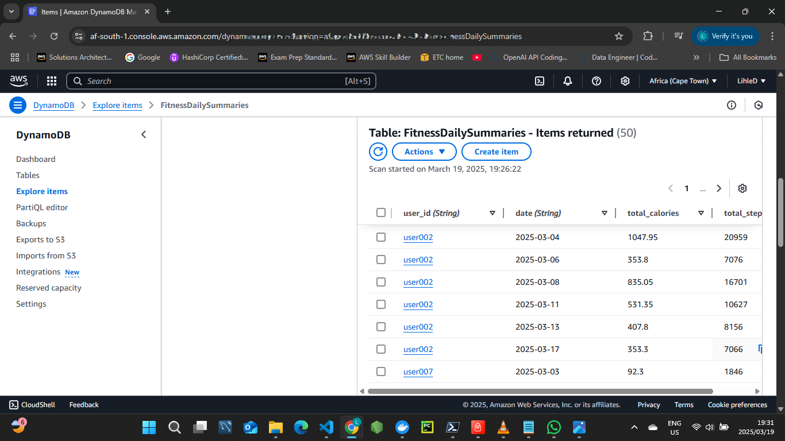
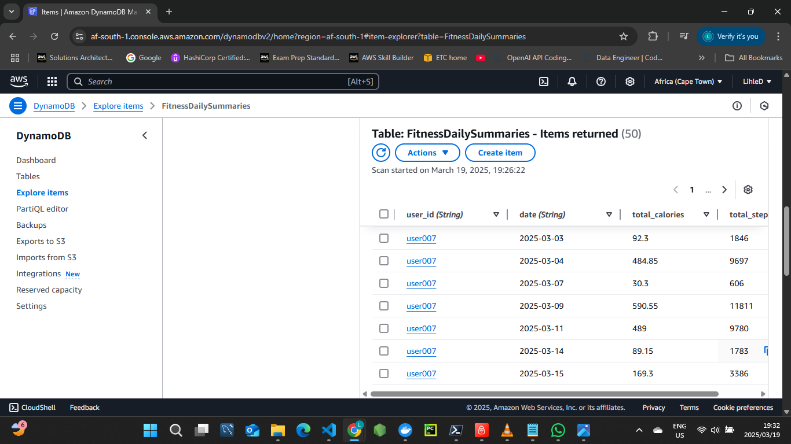
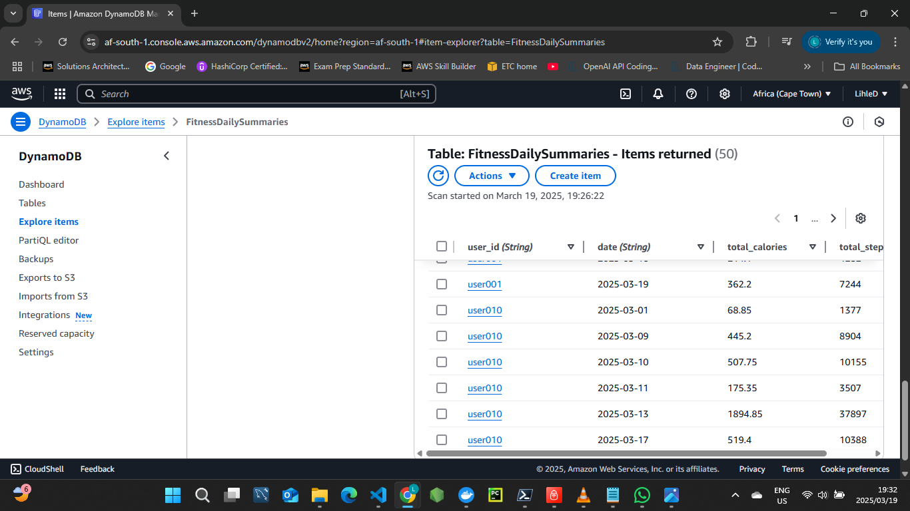

# Fitness Tracker Data Pipeline

A Serverless AWS pipeline to aggregate and store mock fitness tracker data for daily user insights.

## Project Structure
- `data/`: Local mock fitness data (e.g., `fitness_raw_data.csv`).
- `lambda/`: AWS Lambda function code.
- `scripts/`: Utility scripts (e.g., `generate_fitness_data.py`).

## AWS Setup
- **S3 Bucket**: `fitness-tracker-raw-data`
  - Region: `af-south-1`
  - Stores raw CSV files in `input/` folder.

  ## Pipeline Workflow
- **S3 Trigger**: Uploads to `input/` folder (e.g., `fitness_raw_data.csv`) trigger `FitnessDataAggregator`.
- **Lambda**: Aggregates steps and calories by user and date, stores in DynamoDB.
- **DynamoDB**: Stores daily summaries (e.g., `user_id: user001, date: 2025-03-01, total_steps: 12345, total_calories: 617.25`).
- **CloudWatch**: Optional daily run at 8 AM UTC.

## Free Tier Compliance
- S3: < 5 GB (mock data ~10 KB).
- Lambda: < 750,000 seconds/month (few executions).
- DynamoDB: < 25 GB, 5 write units (well within limits).

## Setup Instructions
1. Clone the repo: `git clone https://github.com/LihleDon/Fitness-Tracker-Data-Pipeline.git`
2. Configure AWS CLI with your credentials.
3. Run `scripts/generate_fitness_data.py` to create mock data.
4. Deploy AWS resources (S3, Lambda, DynamoDB) using the provided commands in this README.
5. Upload data to S3 to trigger the pipeline.

## Technologies Used
- **AWS**: S3, Lambda, DynamoDB, CloudWatch.
- **Python**: Data processing with Boto3.
- **Git**: Version control and GitHub hosting.

## Sample Output
Below are examples of aggregated fitness data stored in DynamoDB:

- **Daily Summary 1**: First set of processed user data.
  
- **Daily Summary 2**: Additional user data from a different upload.
  
- **Daily Summary 3**: Further aggregated results.
  

---
- GitHub: [LihleDon](https://github.com/LihleDon)
- LinkedIn: [Lihle Dotyeni](https://www.linkedin.com/in/lihle-dotyeni-28297126b)
